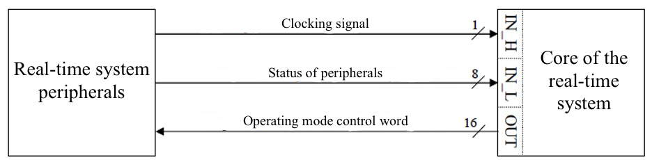

# Assembly language

Assignments on the subject of real-time systems in the university

## Task 1
**Purpose**: to study the principles of representing numerical information in computer memory; to acquire practical skills of representing integers with a sign in machine format.
1. Make and compile a program defining the number 70 in DB, DW, DD formats and the number -2504 in DW, DD formats.
2. Define data forwarding operations such as:
- load the BX register with the number -2504 from the data segment;
- using the specified variant of indirect addressing ([BP][DI]), write the contents of BX into the data segment with an offset of I1 bytes relative to the label I2 (number 70 is preloaded into the appropriate base or index register, if there are other operands in the addressing formula, define them arbitrarily).

## Task 2
**Purpose**: studying commands of arithmetic and logical operations, acquiring practical skills in their use in various computational tasks.
1.	Make a program to calculate the given arithmetic expression (A+891/(B*59+C))*76. Choose the length and value of variables A, B, C independently. Use the constants specified in the expression in the code segment.
2. Describe the multiplication and division commands used in the program in terms of the length of the operands involved in the operation. Characterize the length of the result and where it is stored.
3. Based on the compiled program, perform the following steps:
- load the number 1 into the accumulator and use the commands of logical operations to set a masking word to determine the given characteristic of the contents of the DX register;
- perform the specified check and save its result in the RESULT variable declared in the data segment.

## Task 3
**Purpose**: to study the commands of loop organization and methods of indirect addressing of memory data in the i486 microprocessor; to acquire practical skills of composing programs for processing one-dimensional arrays, to master the methods of analyzing the labor and resource complexity of algorithms for processing one-dimensional numerical arrays.

Find the arithmetic mean of the elements of array A[32] and compose a new array B from the elements exceeding the mean. The resulting array B should be ordered in ascending order, swapping bytes in non-negative elements.

I will break the problem into steps.
1.	Set the initial array A[32] in the data segment.
2.	Find the arithmetic mean of the elements of the array A[32].
3.	Create a new array B containing elements greater than the average.
4. Sort array B in ascending order.
5.	Swap bytes in non-negative elements of array B.

## Task 4
**Purpose**: studying the principles of organizing the input of information from the outside into the computer and the output of information from the computer to the outside, the organization of time delay in data processing in assembly language, as well as acquiring practical skills in programming these operations.

There is an SRV, which includes some hardware peripherals (PU) and the core in the form of a computer (Fig. 4.2), which communicates with the periphery through one 16-bit input port with a given address AIN and one 16-bit output port with a given address AOUT. Input 8-bit data is received on the low byte of the input port. To actualize the input data, the specified operating mode control word (UCRW) must be previously output through the output port. The sending of the MSRP is clocked high via the specified RC bit of the input port. The initial value of the high byte of the MSRP (MSRP[1]) is the specified U0 combination. With each subsequent data request, the value of MSRP[1] is changed by the specified increment ∆U. Due to the hardware time consumption of the peripheral part, data actualization takes place after a specified time interval τ.

The low byte of the MSRP (MSRP[0]) is bitwise modified as follows:
- at each odd iteration, the specified SR bits are set and the RS bits are reset;
- at each even iteration the specified SR bits are reset and RS bits are set.
  Compose a program in assembly language that polls external devices through the input port and writes the sent SDRR and the corresponding data on the state of peripheral devices in one-dimensional arrays of a given length N. Realization of the time delay  is carried out with the help of the DELAY subroutine. The block diagram of the control program algorithm is shown in Fig. 4.3. The set parameters of the SRV are presented in the table.

